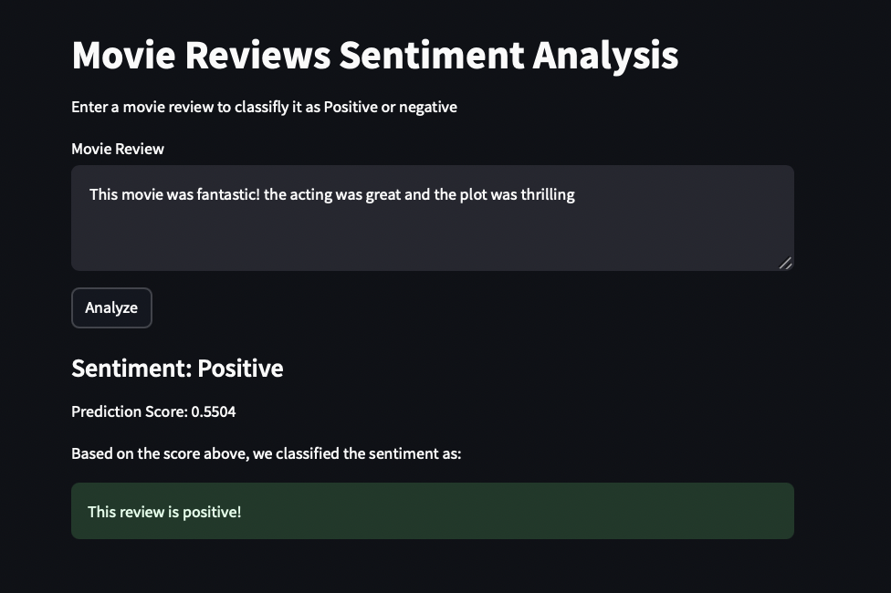

# CineReviewX - Movies Sentiment Analyzers

## Table of Contents
- [About The Project](#about-the-project)
- [About the Data](#about-the-data)
  - [Target Variable](#target-variable)
  - [Dataset Source Link](#dataset-source-link)
- [Technology Stack](#technology-stack)
- [Getting Started](#getting-started)
- [Usage and Configuration](#usage-and-configuration)
- [Contributing](#contributing)
- [License](#license)
- [Contact](#contact)
- [Acknowledgements](#acknowledgements)

## About The Project

CineReviewX is an IMDB movies sentiment analysis project that aims to predict the sentiment (positive or negative) of movie reviews based on text analysis. Using machine learning techniques, this project processes movie reviews and classifies them into different sentiment categories (positive, negative). The project utilizes natural language processing (NLP) models to analyze large datasets of movie reviews and provide insights into the audience's emotional reactions to films.

The project helps filmmakers, critics, and movie enthusiasts understand how audiences feel about movies based on their reviews, enabling data-driven decision-making in the film industry.



### Key Features:
- **Sentiment Classification**: Classifies movie reviews as Positive or Negative.
- **Data Preprocessing**: Prepares and cleans the raw data for use in machine learning models.
- **Text Vectorization**: Converts raw text into numerical form using techniques like TF-IDF and Word Embeddings.
- **Modeling**: Implements Single RNN deep learning models for sentiment analysis.
- **Evaluation Metrics**: Utilizes precision, recall, accuracy, and F1-score to evaluate model performance.

## About the Data

The dataset contains a collection of IMDB movie reviews and their corresponding sentiment labels (positive or negative). It includes user reviews, movie ratings, and associated metadata for each review. The dataset is preprocessed to remove irrelevant information such as stop words, HTML tags, and special characters.

### Key Features:
- **Review Text**: The actual text of the review.
- **Sentiment Label**: A binary label indicating whether the review sentiment is positive (1) or negative (0).
- **Rating**: The rating of the movie on IMDB (optional depending on the dataset).

## Target Variable

The target variable for this project is **Sentiment** (either 1 for positive or 0 for negative), which is derived from the movie reviews. The model's goal is to predict the sentiment label based on the review text.

## Dataset Source Link

The dataset used in this project is publicly available on [Kaggle IMDB Dataset](https://www.kaggle.com/). You can download it directly from there for local use or to train the models.

## Technology Stack

- Python
- Streamlit
- TensorFlow
- Scikit-learn
- Keras
- Pandas
- NumPy
- Pickle

## Getting Started

To get started with this project locally, you’ll need Python 3.8+ installed on your machine along with some necessary Python packages. You can either clone the repository and install dependencies manually or use Docker for an isolated environment.

### Installation Steps

1. Clone the repository:

   - Open your terminal or command prompt.
   - Navigate to the directory where you want to install the project.
   - Run the following command to clone the GitHub repository:
     ```
     git clone https://github.com/shubhamprajapati7748/CineReviewX
     ```

2. Create a Virtual Environment (Optional)

   - It's a good practice to create a virtual environment to manage project dependencies. Run the following command:
     ```
     conda create -p <Environment_Name> python==<python version> -y
     ```

3. Activate the Virtual Environment (Optional)

   - Activate the virtual environment based on your operating system:
     ```
     conda activate <Environment_Name>/
     ```

4. Install Dependencies

   - Navigate to the project directory:
     ```
     cd [project_directory]
     ```
   - Run the following command to install project dependencies:
     ```
     pip install -r requirements.txt
     ```

5. Run the Project
    ```bash
    streamlit run app.py
    ```

6. Access the Project
   - Visit `http://localhost:8501` in your browser to use the app.


## Usage and Configuration

### Web App Usage:

1. **Enter Customer Information**: Input fields for age, gender, geography, and other demographic and account details.
2. **Click "Predict Churn"**: After entering the data, click the prediction button to view the likelihood of churn and whether the customer is likely to churn or not.
3. **Prediction Results**: The app will display the churn probability along with a clear message about the likelihood of churn.

### Configuration:

You can modify the `Artifacts/` directory to point to your own trained models, encoders, and scaler files. Make sure the model and encoders are trained and saved in compatible formats (e.g., `.h5`, `.pkl`).

## Contributing

We welcome contributions to improve this project! Whether you are fixing bugs, adding features, or improving documentation, feel free to fork the repository and submit a pull request.

### Steps to contribute:
1. Fork the repo.
2. Create a new branch (`git checkout -b feature-name`).
3. Make your changes.
4. Commit your changes (`git commit -am 'Add feature'`).
5. Push to your branch (`git push origin feature-name`).
6. Create a new Pull Request.

## License

Distributed under the MIT License. See `LICENSE` for more information.

## Contact

Shubham Prajapati - [@shubhamprajapati7748@gmail.com](shubhamprajapati7748@gmail.com)

## Acknowledgements

- [TensorFlow](https://www.tensorflow.org/): For providing the machine learning framework to train the predictive model.
- [Streamlit](https://streamlit.io/): For creating the interactive web application.
- [Scikit-learn](https://scikit-learn.org/): For preprocessing utilities such as scaling and encoding.
- [Kaggle](https://www.kaggle.com/): For the inspiration behind the dataset, which is similar to the dataset used in this project.

